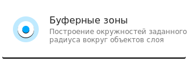
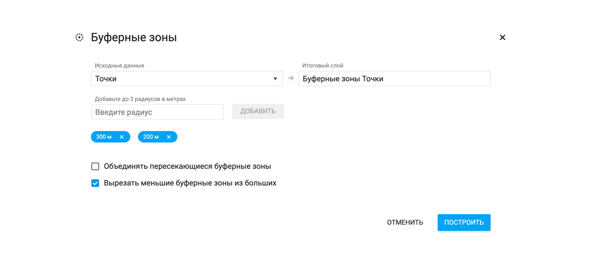

**Буферная зона** - зона, построенная вокруг геообъекта, границы которой удалены на равное расстояние от каждой вершины исходного геообъекта.

Буферные зоны можно строить вокруг объектов любого типа: точек, полигонов (площадных объектов) и линий. Построенные буферные зоны автоматически сохраняются в новый слой и набор данных.

В EverGIS Online буферные зоны строятся сразу для всех объектов слоя.

Чтобы построить буферные зоны, выполните следующие действия:

1. Перейдите во вкладку инструментов в синей левой панели рабочей области карты;

2. Выберите инструмент **Буферные зоны**

3. В поле **Исходные данные** выберите слой, вокруг объектов которого вы хотите построить буферные зоны;

4. В поле **Итоговый слой** укажите название слоя с буферными зонами;
5. Укажите радиус буферной зоны в метрах. Для объектов выбранного слоя вы можете построить 1, 2 или 3 буферные зоны одновременно;
6. Выберите дополнительные опции (при необходимости) - объединение пересекающихся буферных зон, вырезание меньших буферных зон из больших.

Посмотрите наши короткие видео о том, как строить буферные зоны вокруг разных типов объектов.
<video style="width:640px;height:480px" poster controls>
<source src="https://evergis.ru/static/portal/img/6_1.b85d980.mp4" type="video/mp4">
</video>
<video style="width:640px;height:480px" poster controls>
<source src="https://evergis.ru/static/portal/img/6_2.e922a36.mp4" type="video/mp4">
</video>
<video style="width:640px;height:480px" poster controls>
<source src="https://evergis.ru/static/portal/img/6_3.d9976f2.mp4" type="video/mp4">
</video>
<video style="width:640px;height:480px" poster controls>
<source src="https://evergis.ru/static/portal/img/6_4.01682f5.mp4" type="video/mp4">
</video>
