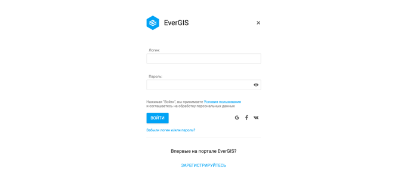
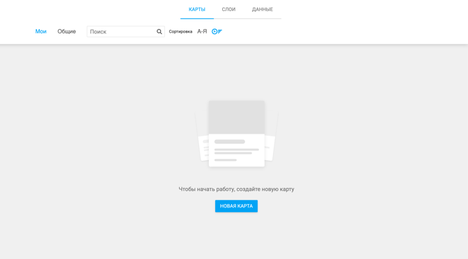
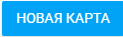
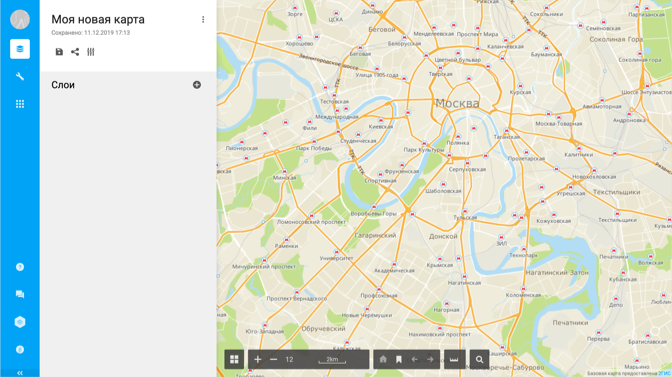

# Полезные термины
**EverGIS Online** - онлайн сервис для анализа, создания, редактирования и оформления географических данных.

**Географические данные** - данные о пространственных объектах, обычно содержащие информацию об их местоположении (координатные данные) и дополнительных характеристиках (атрибутивные данные).

В EverGIS Online можно работать с пространственными объектами 3-х типов:

* **Точки**,
* **Полигоны** - площадные объекты,
* **Линии**.

Атрибуты объектов могут содержать данные разных типов:

* **Строка** - строковый тип данных, значениями которого является текст - произвольная последовательность (строка) символов алфавита;
* **Целое число** - числовой тип данных, служит для представления целых чисел;
* **Дата** - тип данных, который содержит дату, время или дату и время;
* **Дробное число** - числовой тип данных, служит для представления дробных чисел.

Для работы в EverGIS Online используется три вида ресурсов: данные, слои и карта.

* **Данные (географические данные)** - набор пространственных объектов, загруженный в систему или созданный в ней.
* **Слой** - визуальное представление пространственной информации об объектах на карте, созданное на основе набора данных.
* **Карта** - основная рабочая область пользователя EverGIS Online, хранит в себе список слоёв и полное описание их состояния, а также базовую картографическую подложку и экстент карты.

**Базовая картографическая подложка** - нередактируемая карта, визуальная основа (подложка) для представления пользовательских слоёв с геоданными.

**Экстент карты** - площадь земной поверхности, представленной на карте.

Все ресурсы, с которыми может работать пользователь отражены в его личном каталоге. Ресурсы поделены на личные ресурсы пользователя (показаны во вкладке Мои) и открытые ресурсы, доступные всем пользователям системы (показаны во вкладке **Общие**)

**Системы координат** - EverGIS Online поддерживает работу с двумя основными системами координат Lon/Lat WGS84 и Web Mercator WGS84.

**Оформление** - настройка подписей пространственных объектов на карте и стиля представления слоев.

**Буферная зона** - зона, построенная вокруг геообъекта, границы которой удалены на равное расстояние от каждой вершины исходного геообъекта.

**Зона доступности** - зона, построенная вокруг геообъекта, которая показывает, откуда можно добраться до исходного геообъекта в пределах заданного временного интервала. Обычно доступность бывает двух типов - автомобильная и пешая.

**Выборка геометрией** - пространственная операция, которая позволяет с помощью геометрии одного слоя отобрать объекты другого слоя и сохранить их в новый слой.

# Функции и инструменты сервиса
1. Загрузка данных
2. Создание и редактирование геобъектов
3. Оформление слоев:

    a. Изменение стиля слоя:
Выбор готовых символов для объектов из библиотеки
Загрузка изображений для создания новых символов
Настройка цвета, размера и других параметров символов
Настройка сложных классификаторов в зависимости от свойств геообъектов

    b. Настройка подписей геообъектов на карте:
Произвольный текст подписи
Подпись значениями атрибутов объектов
Сложная подпись из произвольного текста и значений атрибутов объектов
4. Построение буферных зон:

    a. Построение нескольких буферных зон одновременно

    b. Объединение пересекающихся буферных зон

    c. Вырезание меньших буферных зон из больших
5. Построение зон автомобильной доступности:

    a. Построение нескольких зон доступности одновременно
    b. Объединение пересекающихся зон доступности
6. Выборка объектов одного слоя с помощью геометрии другого

7. Создание публичной ссылки на карту (шаринг)

# Начало работы
1. Для начала работы в EverGIS Online авторизуйтесь - https://evergis.ru/signin. Для авторизации используйте имя пользователя и пароль, которые вы получили от нас по электронной почте.

2. После авторизации вы попадёте в каталог ресурсов. Через каталог вы сможете создавать карты, слои, загружать данные и управлять всеми доступными вам ресурсами.

3. Создайте свою первую карту по клику на кнопку:

_Подробнее про создание карт читайте здесь_

4. Как только карта будет создана, откроется основная рабочая область. Добавлять слои на карту можно тремя способами:

* Выбрать нужные слои из существующих в каталоге,
* Создать пустой слой на карте,
* Создать новый слой путем загрузки данных.

_Подробнее про создание слоев читайте здесь_

