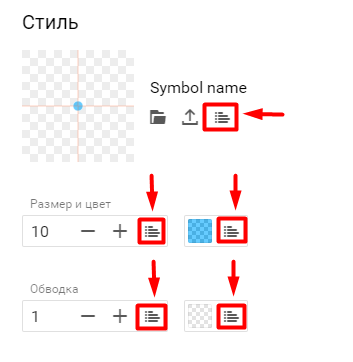

**Оформление** - настройка подписей пространственных объектов на карте и стиля представления слоев.

Функции оформления слоев позволят вам просто, красиво и понятно представить на карте ваши данные.

В EverGIS Online настройки оформления состоят из 2-х блоков:

* Стиль;
* Подпись.

Чтобы воспользоваться функциями оформления, найдите интересующий вас слой в левой панели рабочей области карты. Если слой скрыт, сделайте его видимым. Откройте меню слоя и вебрите пункт **Оформление**.

# Настройка стиля
В EverGIS Online вы можете задать простые настройки для параметров стиля слоя или воспользоваться классификаторами. К параметрам стиля относятся:

* символ,
* размер символа,
* цвет заливки,
* толщина обводки,
* цвет обводки.
Перечень доступных настроек зависит от типа пространственных объектов в слое.

## Точечные объекты

1. Выбор символа из галереи EverGIS Online:
* базовая форма - круг или квадрат,
* сложный символ - тематический условный знак;
2. Загрузка своего символа;
3. Классификация объектов по символу;
4. Настройка точки привязки символа к карте;
5. Настройка размера символа, в т.ч. классификация по размеру;
6. Настройка цвета символа, в т.ч. классификация по цвету;
7. Настройка толщины обводки символа, в т.ч. классификация по толщине обводки - только для базовых форм символа;
8. Настройка цвета обводки символа, в т.ч. классификация по цвету обводки -только для базовых форм символа.

**Точка привязки** - местоположение символа на карте по отношению к центру геообъекта. Чтобы настроить точку привязки выберите мышкой точку пересечения осей XY в области предпросмотра символа.

## Полигональные (площадные) объекты

1. Настройка цвета заливки объекта, в т.ч. классификация по цвету заливки;
2. Настройка толщины обводки объекта, в т.ч. классификация по толщине обводки;
3. Настройка цвета обводки объекта, в т.ч. классификация по цвету обводки.

## Линейные объекты

1. Настройка цвета линии, в т.ч. классификация по цвету линии;
2. Настройка толщины линии, в т.ч. классификация по толщине линии.

## Простая настройка стиля

Посмотрите наше короткое видео, как красиво оформить слой на карте при помощи простых настроек параметров стиля.
<video style="width:640px;height:480px" poster controls>
<source src="https://evergis.ru/static/portal/img/9_1.3f06985.mp4" type="video/mp4">
</video>

## Настройка стиля при помощи классификаторов

**Классификация** - группировка объектов слоя по значениям их атрибутов и дальнейшая настройка параметров оформления отдельно для каждой группы (класса).

Классификацию целесообразно применять для создания аналитических карт, если вы хотите визуально выделить группы объектов, обладающих схожими характеристиками (атрибутами). Объекты слоя можно разбить на группы (классы) по любому атрибуту, содержащемуся в данных.

Вид классификации зависит от типа данных в атрибуте объекта, по которому вы хотите разбить объекты на группы:

* **По уникальным значениям атрибута** (для строковых типов данных) - вы выбираете атрибут, система считает уникальные значения атрибута и на их основе формирует группы объектов. По умолчанию количество выделенных групп соответствует количеству уникальных значений атрибута, но вы можете удалить группы, для которых не хотите настраивать особый стиль.
* **По непрерывной шкале** (для числовых типов данных) - вы выбираете атрибут, система делит значения атрибута на интервалы и на их основе формирует группы объектов. Вы можете сами указать количество групп (классов), изменить границы групп вручную или рассчитать их автоматически

Вы можете одновременно настроить классификаторы для нескольких параметров стиля: по символу, по размеру символа, по цвету заливки символа, по цвету обводки символа.

Чтобы перейти в настройку классификаторов, кликните на соответствующую иконку рядом с нужным параметром.

Посмотрите наши короткие видео о том, как пользоваться классификаторами.
<video style="width:640px;height:480px" poster controls>
<source src="https://evergis.ru/static/portal/img/9_2.4915294.mp4" type="video/mp4">
</video>
<video style="width:640px;height:480px" poster controls>
<source src="https://evergis.ru/static/portal/img/9_3.a30e72b.mp4" type="video/mp4">
</video>

## Настройка подписи

В EverGIS Online есть возвожность подписать объекты любого слоя на карте. Настройки подписи применяются ко всему слою.

Вы можете настроить следующие параметры:

1. Текст подписи:
написать произвольный текст,
использовать в качестве подписи значения из одного или нескольких атрибутов объектов слоя,
сочетать произвольный текст со значениями из атрибутов объектов слоя;
2. Формат подписи:
выбрать шрифт,
указать размер шрифта,
настроить цвет текста,
выбрать тип начертания - простой, полужирный, курсив;
3. Гало - эффект контура вокруг текста, визуально отделяет текст от прочих объектов на карте:
задать толщину границ гало,
настроить цвет гало;
4. Расположение подписи относительно символа объекта - только для слоев с точечными объектами.

Посмотрите наше короткое видео, как легко настроить подпись в EverGIS Online.
<video style="width:640px;height:480px" poster controls>
<source src="https://evergis.ru/static/portal/img/9_4.b13bc61.mp4" type="video/mp4">
</video>