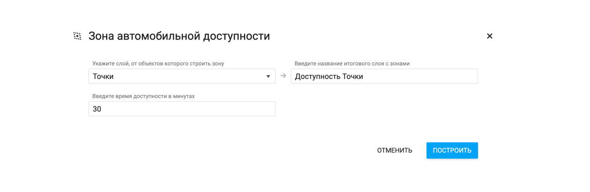

**Зона доступности** - зона, построенная вокруг геообъекта, которая показывает, откуда можно добраться до исходного геообъекта в пределах заданного временного интервала. Бета-версии EverGIS online позволяет строить зоны автомобильной доступности вокруг точечных объектов.

Построенные зоны доступности автоматически сохранятся в новый слой и набор данных. Зоны доступности строятся сразу для всех объектов слоя.

Чтобы построить зоны доступности, выполните следующие действия:

1. Перейдите во вкладку инструментов в синей левой панели рабочей области карты;

2. Выберите инструмент Зоны доступности

3. В поле Исходные данные> выберите слой, вокруг объектов которого вы хотите построить зоны доступности;
4. В поле Итоговый слой укажите название слоя с зонами доступности;
5. Укажите время доступности в минутах;
6. Выберите дополнительную опцию (при необходимости) - объединение пересекающихся зон доступности.

Посмотрите наши короткие видео о том, как строить зоны доступности.
<video style="width:640px;height:480px" poster controls>
<source src="https://evergis.ru/static/portal/img/7_1.6d2126f.mp4" type="video/mp4">
</video>