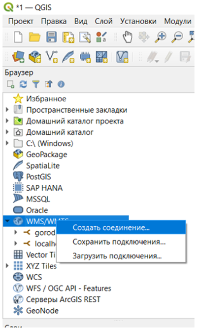
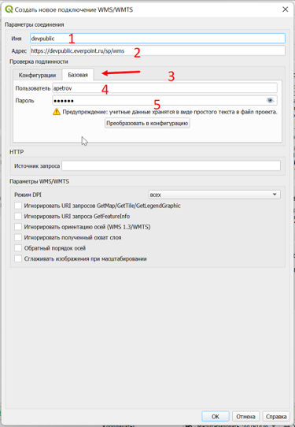
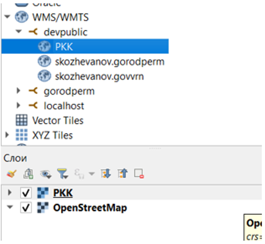

1. В браузере выбираем пункт меню WMS/WMTS
2. В контекстном меню выбранного пункта выбираем «Создать подключение» (рис. 1)
3. В появившемся окне «Создать новое подключение WMS/WMTS» (рис. 2) заполняем:
* Имя (1) – отображаемое имя
* Адрес (2) – url адрес WMS сервера (например https://ever.2gis.ru.ru/sp/wms)
* Во вкладке «Базовая» (3) блока проверка подлинности заполнить поля: имя пользователя (4) и пароль (5) от системы EverGIS
4. Добавляем необходимый слой на карту QGIS (рис. 3)

Рис. 1

Рис. 2

Рис. 3